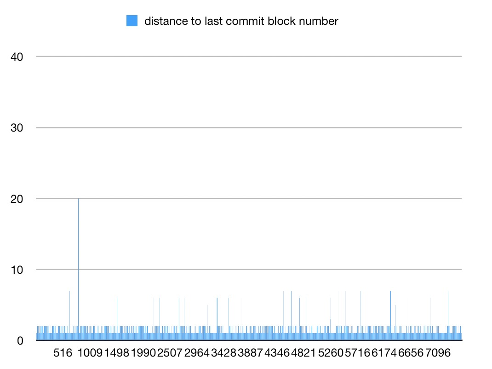
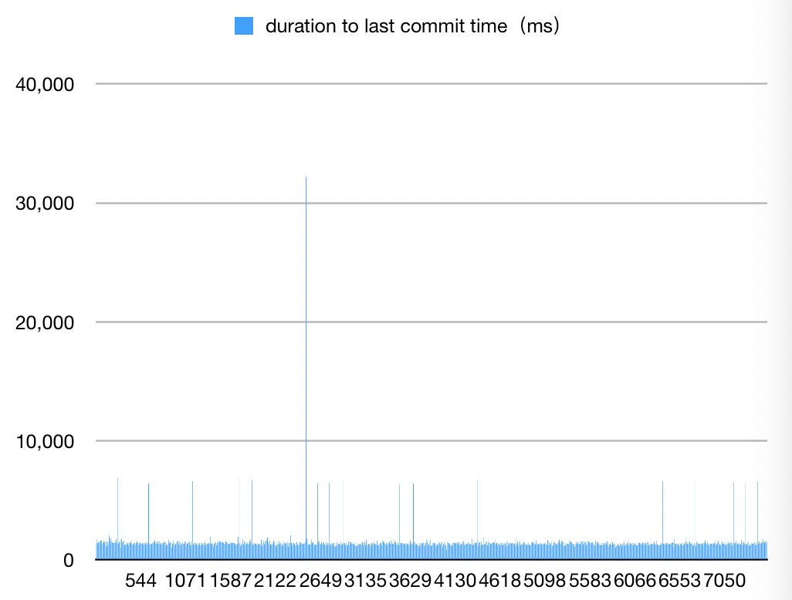
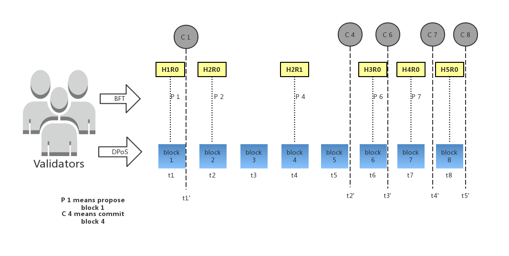

# Contentos技术白皮书

Contentos是一个聚焦于内容服务的区块链系统。系统提供了完善的帐号安全机制，能够最大程度的保护帐号安全，同时满足灵活的运营需求。内置的经济规则鼓励用户向系统贡献价值内容、加强互动和参与度。在底层区块链共识机制方面，Contentos在DPoS基础上，还引入了BFT机制进一步提升服务响应速度，实现saBFT算法，相比于POW大幅提升了TPS。

Contentos系统同时提供基于HTTP/2协议的gRPC接口服务和 JSON格式的RESTful接口服务，支持前端应用通过HTTP、HTTPS接入。系统还提供智能合约功能，允许用户自行开发dApp，最大化的满足个性化需求。为了进一步提升智能合约系统的易用性，Contentos向智能合约开放丰富的API，不仅支持链上数据查询和转账交易，还支持全面的内容管理，以及合约之间的灵活调用。针对常见的用户业务需求，Contentos还提供一批智能合约模版，降低智能合约应用的技术门槛，方便更多用户快速部署。

## 1. 共识机制

### 1.1 设计理念

受制于计算机科学中的 CAP 理论： 一个分布式系统最多只能同时满足一致性（Consistency）、可用性（Availability）和分区容错性（Partition tolerance）这三项中的两项。Contentos 借鉴了众多公链的底层设计及核心理念，研究显式处理网络分区案，通过优化数据的一致性算法及可用性，取得三者之间的平衡。进而使整个Contentos 网络的效率、 一致性、不可逆性及开放性得到极大提升。基于链的DPoS算法倾向于选择可用性高的而不选择一致性高的，因为可用性高意味着所有的交易都能被处理，不过要以牺牲整个网络中一致性状态复制为代价。基于BFT的却相反，会倾向于选择高一致性。

Contentos 基于 BFT 实现了一种自适应的共识算法 saBFT（*self-adaptive Byzantine Fault Tolerance*）。

它使用 DPoS 相同的方式生成块，并采用 BFT 实现快速块确认。它是自适应的，可以根据区块链和网络流量的负载调整 BFT 进程的频率。

**术语**

- Node：服务节点，运行Contentos程序的服务器（cosd）
- Block producer：生产节点，生成新区块的节点
- Validator：验证节点，参与 BFT 共识的节点
- Proposer：提案者，广播提案的验证节点
- Proposal：提议，所有validators试图达成共识的块，一旦达成，它将被提交
- Commit：提交块，意味着将块标记为最后一个不可逆块

**区块生产**

saBFT 使用与 DPoS 相同的方式生成块。 每个验证节点轮流生成10个块，每秒生成一个块。 有可能出现分叉，最长的链会被认为是当前的主要分支。

**分叉切换**

如果另一个分支高度超过主分支，则发生`Switch Fork`。
- 找到两个分支的共同祖先，在祖先之后弹出主分支上的所有块，并在较长分支上应用区块

### 1.2 为什么使用BFT

在许多情况下都需要即时交易，尤其是涉及资产转移时。在比特币世界中，无法保证某个区块的最终确定，因为理论上任何具有足够资源的节点都可以生成更长的链并导致`Switch Fork`。 这在分布式系统领域直接违反了安全性法则。因此，我们采用 BFT 来实现快速共识。 一旦某个区块达成共识，就永远无法逆转。

### 1.3 特点

saBFT 的块生产过程和 BFT 过程完全解耦。即，无论 BFT 过程的状态如何，验证节点都可以生成块。假设当前块高度为100，并且 BFT 进程仅提交高度为90的块，验证节点可以开始生成101块，而无需等待块91-100被提交。

另一个显著差异是 BFT 过程不必在每个块上达成共识。达到共识的两个连续块的高度差称为`Margin Step`。它由 saBFT 根据Contentos链的网络状况和负载自动调整。 saBFT 通常每1或2秒达到一致，由于负载较重、网络流量或拜占庭节点的存在，共识步骤会增加。

### 1.4 性能

局域网中，saBFT 在1~2秒内达成共识。 BFT 过程采用三阶段提交（提议，预投票，预提交），在提议阶段，验证节点同步等待提议者广播提议，其余两个阶段完全异步，大幅提升了共识效率。

为了更好展示saBFT的性能，我们做了以下的测试：

**测试环境**

| 分类     | 描述        |
| -------- | ----------- |
| 机器配置 | 2 CPU、8 GB |
| 带宽     | 100 GB/s    |

**模拟场景限制**

| 条件               | 参数     |
| ------------------ | -------- |
| 共识节点           | 19       |
| 带宽限制(两节点间) | 100 KB/s |
| 区块大小           | 50 KB    |
| 连续区块采样数     | 7000+    |

**Margin Step的平均个数为 1.5**

**两个连续已提交区块平均时间间隔为 1500 ms**

**一个区块从生成到被确认的平均时长为 1800 ms**

### 1.5 自适应

saBFT 在网络堵塞、验证节点崩溃或拜占庭节点的情况下，可以延迟块确认。自适应机制确保系统可以在后续轮次中快速确认最新生成的块。

在每一轮投票中，所有验证节点都选择了一个新的提议者。提议者只是提出它知道的最新块，当它被确认时，它之前的所有块也将被确认。在网络延迟的情况下，其他验证节点可能不会收到建议的块或其投票。如果验证节点总是提议最新的区块，那么在很长一段时间内可能无法达成共识。为了克服这个问题，如果在几轮投票中未达成共识，则提议使用比头部区块序号更小的块。

BFT 过程可以被认为是状态机，由高度(H)，轮次(R)和步骤组成。这里省略步骤以简化该过程。在每个高度中，存在一个或多个轮次。从每个高度的0开始，如果在本轮中没有达到BFT共识，则增加。 H1R0表示当前状态的高度为1，轮次为0。

下图说明了如果我们之前提到的任何异常情况发生，saBFT 如何调整其 BFT 过程。

在 $t_1$，生成块1，同时 BFT 过程开始，提议者提出块1。很快在 $t_1'$ $(t_1 <t_1'<t_2)$，达到共识并且块1被提交。在 $t_2$，生成块2并提出它。然而事情变得混乱，并且在超时前第0轮未达成共识。在 $t_4$状态进入 H2R1，并提出块4。最后在 $t_2'$，在块4上达成共识，并且块2-4立即被提交。从 $t_6$ 开始，事情会恢复正常，第5块之后的所有块都会在1秒内完成。如上所示，高度2的 `Marge Step` 为4，之后它迅速下降到1。

### 1.6 最差的情况
根据 **FLP不可能性**，在异步网络中，没有**确定性**方法在一个错误的过程中达成共识。在每一轮的 BFT 过程中，始终存在严重的故障，如崩溃，网络堵塞或恶意节点广播坏消息，这会搞乱投票过程。理论上存在这样一种情况：每一轮 BFT 最终都会失败，但随着轮的增长，这种可能性会呈指数级下降。担心这一点有点过于偏执。

最重要的是，没有完美的方法来保证安全和可用。我们把安全作为我们的首要任务，唯一需要担心的是，太多未提交的块可能最终会占用内存资源。但我们可以很容易地提出**保留政策**来丢弃远远不到的块，这超出了本讨论的范围。

### 1.7 拜占庭惩罚

只要我们跟踪足够多信息，技术上的异常行为就可以追究责任。

* 应从验证节点集中删除离线或经常不在块生成或 BFT 投票中的验证节点

* 具有以下行为的验证节点应受到惩罚：

  1. 生成冲突的块

  2. 签署相互冲突的选票

  3. 违反[POL](https://github.com/coschain/gobft)投票规则

  4. 不断提出无效块

## 2. 并行处理架构

我们提出了并行流水线交易处理架构，通过最大化地利用计算力资源，达到提升TPS的目标。

设计思路大致总结为以下几个方面：

- 对状态数据进行高度抽象，打破存储对象的逻辑，认为存储数据的最小单元为“属性”，逻辑上的数据对象只是“属性”的组合。“属性”之间是独立的，不同“属性”可以安全的并行读写。数据的属性化重构，是并行化的基础。
- 将交易处理过程拆分为4个阶段：解码、读取、执行、回写。解码负责分析出输入、输出属性集和一个结构化的计算函数。读取负责从数据库读出输入属性的值。执行负责根据输入属性运行计算函数，得到输出属性的值。回写负责更新输出属性到数据库。在此基础上，可以构造一个4段并行流水线。只有读取和回写线有数据库IO，它们阻塞时其他线仍在工作，降低计算力的浪费。 
- 流水线控制逻辑，根据交易解码结果，分析交易依赖关系，进行正确的并行调度。

## 3. 经济系统

- Contentos 系统内通货标识为 COS，COS 参与一切流通性行为，在目前版本下，流通特指钱包之间的转账行为。

- 持有通货并不会得到额外的权益，如果需要获取系统权利，需要对通货进行冻结，以换取无利率凭据。系统内，该凭据的标识为 VESTS。VESTS 持有的数量直接决定了系统内操作的影响力，比如可以改变奖励池的分配关系。足够的 VESTS 数量也提供了竞选为 block producer 的资格。
- COS 和 VESTS 的比例恒定为 1:1
- Contentos 系统每一秒产生一个新的区块，每个区块产生时，新的 VESTS 将会被追加进奖励池以及直接支付给 block producer.
- 每个区块产生的 VESTS 数目由数学模型所决定。必要时，所有理事会成员可以通过投票干预模型，以调节新增 VESTS 数目，从而使系统内经济能满足生产力需求
- dApp的开发者通过向生态贡献代码和工具，最多可以从奖励池中获取整体的 10% 的VESTS。
- 其他普通用户通过参与系统内活动，以从奖励池中分享 VESTS。
- 目前系统主要活动是“创造内容”，详细来说包括上传视频以及发表评论。其中，前者分享 56.25% 奖励池中收益，后者分享 11.25% 奖励池的收益。奖励池是累计的，每个新区块产生的时候，会在链上去查找是否有满足奖励结算的对象，并根据数学公式分别进行奖励；如果没有，本次新产生的奖励会累加进奖励池。
- 每个新区块产生奖励的 15% 会直接作为激励进入 block producer 的账户.
- 每个新区块产生奖励的 10% 作为 dapp 的奖励，如果结算对象是通过 dapp 发布，那么 dapp 的作者会根据结算对象的权重来从这个奖励池中获取奖励。
- 创造者和评论者奖励遵循同样的算法，称为”过去窗口权重累计算法“。具体到某个创作品和评论，其在结算时间点分得的 VESTS 数主要由三个因素决定，第一个是当前的“过去积累 rshares ”，第二个是当前奖励池的大小，第三个是该作品的 rshares。
- rshares 用来描述一个作品被投票（点赞）之后获取的权重。该值由两个变量决定，一个是投票用户的 VESTS，一个是该用户的 VOTE POWER。后者由一个复杂的公式计算出来。VESTS 和 VOTE POWER 进行一个计算之后，可以得出该用户的 rshare。而所有对该作品进行投票用户的 rshare 之和，即为 rshares。
- 每当一个作品被结算，其 rshares 会被累加进 “过去积累 rshares”，即 `p_rshares` 中。为了防止 `p_rshares` 只增不减，额外规定了 `p_shares` 的衰减函数。准确来说，每一个区块产生的时候，`p_shares` 会衰减掉 `1 / (86400 * 17) p_shares` 的数量。也就是说，某一个 rshares 会持续影响 17 天内的结算。
- 如果已知 `p_shares` , `rewards`, 与一个作品在结算点的 `shares` ，那么该作品作者能得到的奖励为 `shares * (rewards / p_shares)`。
- 每个作品发布到结算的窗口期为 7 天，当前时间 + 7 * 86400 即为结算时间，结算有且只有一次。如果对超过窗口期的作品进行投票，该投票会被直接忽略。
- COS 与 VESTS 可以互相转化。前者到后者的过程称为 Power up，因为权利增加了。反之后者向前者的转化称为 Power down。
- power up 转化是瞬间的，并且可以把自己的 COS 转给别人的 VESTS 账户。
- power down 过程是渐进的，申请提交后，每周可以获取到转化额的 1/13 的部分，13 周才能完整拿到全部 COS。并且只能转化自己的 VESTS 到自己的 COS 账户。每个用户同时只能有一个 power down 请求进行。

## 4. 资源

### 4.1 Contentos的系统资源

网络带宽资源和CPU计算资源

- 网络带宽资源

  用户发送一笔交易信息后，区块生产者需要将交易打包生成区块，然后将区块通过网络同步给其它生产者，这个过程需要消耗一定网络带宽资源。而带宽资源的计量方式为，交易信息在区块中所占的字节数，比如，一条交易信息占用100字节，如果用户进行10笔交易的话，大概需要100 * 10 = 1KB。带宽资源的计费方式类似手机流量，用户每发送一笔交易信息就消耗一些耐力值，如果耐力值不足，则无法继续发送交易。

- CPU计算资源

  当用户调用智能合约时，区块生产者需要根据智能合约地址查找合约代码，然后将代码加载到内存中执行，这个过程需要消耗一定的CPU算力。CPU计算资源的计量方式为，用户每次调用智能合约都会消耗一些耐力，如果耐力不足将会扣除用户剩余所有耐力。

### 4.2 计费方式

Contentos系统考虑到用户的使用便捷性，把网络带宽资源和CPU计算资源统一成耐力资源，系统会把网络带宽和CPU两种资源消耗按照一定的换算比例进行统一计算，得到一次交易的总耐力值再进行抵扣。

**特殊说明**

- 用户耐力值不足以支付当前交易的网络资源消耗，交易会被丢弃，耐力值不会进行扣除。
- 用户耐力值可以满足当前交易的网络资源消耗，但是交易非法，交易会被丢弃，耐力值会被正常扣除。
- 用户耐力值可以满足当前交易的网络资源消耗，但是不满足交易中的虚拟机计算资源消耗，交易会被丢弃，用户剩余的全部耐力值会被扣除。

### 4.3 耐力获取

用户会有两种方式获取到耐力

- 免费耐力

  每个用户24小时内，会有免费的耐力值提供使用（每24小时完全恢复），这个免费耐力值不可以累加。

- 抵押COS

  如果用户有更多的耐力使用需求，可以使用COS抵押成 VEST 得到耐力值， 用户抵押的COS和Contentos系统中所有用户抵押COS的占比来计算分配的耐力总额度（每24小时完全恢复），Contentos系统使用指数加权移动平均算法，计算用户24小时内耐力的使用和恢复情况。     

**指数加权移动平均算法** : 

指数加权移动平均(Exponentially Weighted Moving Average)，他是一种常用的序列处理方式。在 $t$ 时刻，他的移动平均值公式是： $V_t=\beta V_{t-1}+(1-\beta)\theta_{t}$   $t=1,2,3,...n$  ，其中 $V_t$ 是 $t$ 时刻的移动平均预测值； $\theta_{t}$ 为 $t$ 时刻的真实值；$\beta$ 是权重；通过当前的实际值和前一段时期(由 $\beta$ 约定平均了多少以前的数据)来求平均值，生成一个平稳的趋势曲线。

## 5. 帐号系统

### 5.1 命名规则

帐号名是Contentos区块链帐号的唯一标识。有效的帐号名包含6～16个字符，每个字符可以是任意的小写英文字母、阿拉伯数字。长度和字符集的限制条件，几乎不会增加用户选取合适名称的难度，但Contentos系统却可以在工程上大幅降低存储和提高名称查找匹配效率。

### 5.2 鉴权

Contentos使用数字签名进行权限鉴定。每个用户的账号拥有自己的一对公私钥，用户发布一个transaction前，必须用自己的登录私钥对其签名。block producer节点在收到transaction后，会首先验证数字签名是否合法，如果检查不通过，transaction将被拒绝执行。

## 6. 存储服务

Contentos作为内容公链，需要支持海量数据存储。经过对主流数据库的调研，决定使用LevelDB作为底层数据持久化存储，并且对LevelDB做了性能测试：

##### initial dataset = 100,000

|        | leveldb/key: int64 | leveldb/key: string16 |
| ------ | ------------------ | --------------------- |
| INSERT | 190,985            | 193,573               |
| QUERY  | 36,627             | 39,842                |
| UPDATE | 32,107             | 29,975                |
| DELETE | 228,10             | 223,41                |

##### initial dataset = 1,000,000

|        | leveldb/key: int64 | leveldb/key: string16 |
| ------ | ------------------ | --------------------- |
| INSERT | 189,322            | 174,581               |
| QUERY  | 33,231             | 34,575                |
| UPDATE | 29,455             | 28,918                |
| DELETE | 254,647            | 198,649               |

##### initial dataset = 10,000,000

|        | leveldb/key: int64 | leveldb/key: string16 |
| ------ | ------------------ | --------------------- |
| INSERT | 174,794            | 165,809               |
| QUERY  | 23,347             | 12,996                |
| UPDATE | 22,795             | 17,041                |
| DELETE | 248,015            | 237,812               |

> 详细内容参考：[db_benchmark](https://github.com/coschain/db_benchmark)

可以看到LevelDB在不同数据量级，仍然可以提供很高的数据读写性能。

Contentos设计了一套高性能、高可靠的存储服务，结合对内存数据库和LevelDB的使用，存储服务不仅支持数据的高性能读写，还支持数据更新时的事务控制、数据快速回滚能力，最大程度的保证区块数据的读写性能和持久化能力。

## 7. 智能合约和虚拟机

**技术背景**

COS智能合约使用C/C++做为主要编程语言，底层采用WebAssembly虚拟机。WebAssembly(WASM)是一个已崭露头角的Web标准，受到Google, Microsoft, Apple及其他大公司的广泛支持。目前为止，最成熟的用于构建应用及WASM代码编译的工具链是CLANG/LLVM及其C/C++编译器。第三方开发的其他工具链包括：Rust，Python和Solidity。虽然这些其他语言看起来可能更简单，但它们的性能可能会影响您可以构建的应用程序的规模。

**合约能力**

用户可以把自己开发的合约预编译成WASM字节码部署到区块链中，Contentos会提供一套API支持合约的外部调用。COS智能合约提供类似以太坊ERC20规范下的开发能力，也可以通过系统提供的API进行发帖，点赞，数据统计等操作。

合约支持热更新，可以帮助用户快速修正BUG。

**合约限制**

考虑到用户使用Contentos区块链服务的公平性，每个用户智能合约执行时长，使用CPU、网络、内存资源都会被限制。

**开发编译**

使用C/C++做为主要编程语言，我们会提供一套封装好的COS C/C++ API支持合约的开发，这套API有更强大的类型安全性，并且更易于使用和阅读。

提供合约编译脚本，可以很方便的编译合约、生成WASM字节码文件和ABI接口文件。

**安全机制**

首先，合约是运行在一个沙箱化的执行环境中。并且WASM通过减少其语义中较为危险的特性并同时保持对C/C++在语法上的最大兼容性来保证一个较高的安全性和可用性。我们在合约运行前，预先对合约本身做严格的权限检查和资源限制，更好的保障安全。

## 8. 虚拟机内容API

除了虚拟机自身的能力之外，Contentos的虚拟机还提供足够丰富的原生链的API来帮助内容开发者，这样开发者可以通过编写dApp来实现各种高级的功能。规划中会开放的API包括但不限于以下方面：

- 用户在链上的任何raw操作，譬如：获取某个交易的具体内容
- 链上产生的虚拟操作数据，譬如：得到某个时段内block producer获得的奖励值
- 向native链提交写操作，譬如：进行发帖或者进行点赞
- 合约之间相互交互的操作，譬如：根据另外一个合约的执行结果来决定本合约的执行流程

**示例**

举一个具体的例子：譬如推广方A需要宣传某款物品，进而和网红B进行合作，和B约定，7天之内如果B创作的宣传视频得到10000人点赞，那么A会给予B 100个COS作为奖励。这样一个流程就可以采用合约API很好的进行实现：

1. 首先A部署合约，将100个COS质押到合约中
2. 当B发完视频后触发合约启动
3. 7天过后，合约自动执行，通过内容api获取到视频的点赞人数，如果结果符合协议，那么调用转账API将COS转入B的账户中，如果不符合协议，则根据合约程序返还给A账户

## 9. 合约模版

目前大部分公链在提供合约功能的同时并没有很好的合约模版和自动化部署合约的功能，这使得普通用户根本无法享受到合约带来的好处。Contentos公链在这个方面会实现的非常易用，公链自身会集成几十种常用的合约，并且为这些合约开发易用的API接口。Dapp的开发者可以提交模版集成建议，在被开发团队采纳后会直接更新到公链的核心代码中。

## 10. 插件

Contentos公链支持插件扩展，可以很方便的通过开发自定义插件去扩展服务节点的功能。目前开发团队已提供`TrxSqlService`、`StateLogService`、`DailyStatService`三个共用插件，支持对链上数据统计分析的需求场景。开发团队欢迎开发者提交不同的公共插件，如果被采纳会集成到Contentos公链主版本中。使用插件服务会额外消耗服务节点的计算资源，建议在非生产节点开启插件功能。