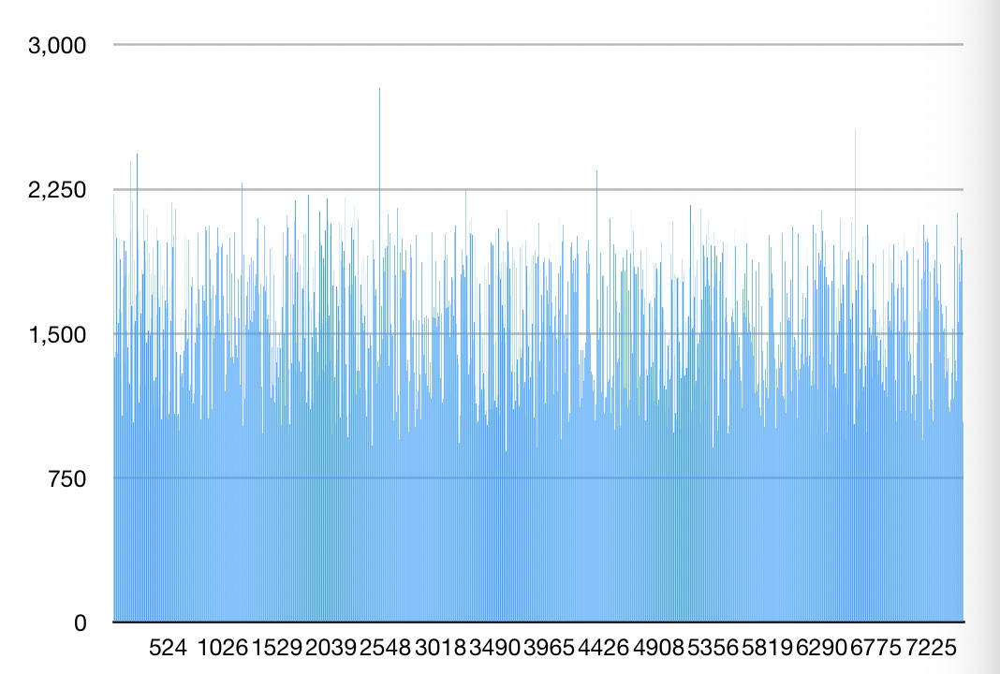

# Contentos技術白皮書

Contentos是一個聚焦於內容服務的區塊鏈系統。系統提供了完善的帳號安全機制，能夠最大程度的保護帳號安全，同時滿足靈活的運營需求。內置的經濟規則鼓勵用戶向系統貢獻價值內容、加強互動和參與度。在底層區塊鏈共識機制方面，Contentos在DPoS基礎上，還引入了BFT機制進一步提升服務響應速度，實現saBFT算法，相比於POW大幅提升了TPS。

Contentos系統同時提供基於HTTP/2協議的gRPC接口服務和 JSON格式的RESTful接口服務，支持前端應用通過HTTP、HTTPS接入。系統還提供智能合約功能，允許用戶自行開發dApp，最大化的滿足個性化需求。為了進一步提升智能合約系統的易用性，Contentos向智能合約開放豐富的API，不僅支持鏈上數據查詢和轉賬交易，還支持全面的內容管理，以及合約之間的靈活調用。針對常見的用戶業務需求，Contentos還提供一批智能合約模版，降低智能合約應用的技術門檻，方便更多用戶快速部署。

## 1. 共識機制

### 1.1 設計理念

受制於計算機科學中的 CAP 理論： 一個分佈式系統最多只能同時滿足一致性（Consistency）、可用性（Availability）和分區容錯性（Partition tolerance）這三項中的兩項。 Contentos 借鑒了眾多公鏈的底層設計及核心理念，研究顯式處理網絡分區案，通過優化數據的一致性算法及可用性，取得三者之間的平衡。進而使整個Contentos 網絡的效率、 一致性、不可逆性及開放性得到極大提升。基於鏈的DPoS算法傾向於選擇可用性高的而不選擇一致性高的，因為可用性高意味著所有的交易都能被處理，不過要以犧牲整個網絡中一致性狀態復制為代價。基於BFT的卻相反，會傾向於選擇高一致性。

Contentos 基於 BFT 實現了一種自適應的共識算法 saBFT（*self-adaptive Byzantine Fault Tolerance*）。

它使用 DPoS 相同的方式生成塊，並採用 BFT 實現快速塊確認。它是自適應的，可以根據區塊鍊和網絡流量的負載調整 BFT 進程的頻率。

**術語**

- Node：服務節點，運行Contentos程序的服務器（cosd）
- Block producer：生產節點，生成新區塊的節點
- Validator：驗證節點，參與 BFT 共識的節點
- Proposer：提案者，廣播提案的驗證節點
- Proposal：提議，所有validators試圖達成共識的塊，一旦達成，它將被提交
- Commit：提交塊，意味著將塊標記為最後一個不可逆塊

**區塊生產**

saBFT 使用與 DPoS 相同的方式生成塊。每個驗證節點輪流生成10個塊，每秒生成一個塊。有可能出現分叉，最長的鏈會被認為是當前的主要分支。

**分叉切換**

如果另一個分支高度超過主分支，則發生`Switch Fork`。
- 找到兩個分支的共同祖先，在祖先之後彈出主分支上的所有塊，並在較長分支上應用區塊

### 1.2 為什麼使用BFT

在許多情況下都需要即時交易，尤其是涉及資產轉移時。在比特幣世界中，無法保證某個區塊的最終確定，因為理論上任何具有足夠資源的節點都可以生成更長的鏈並導致`Switch Fork`。這在分佈式系統領域直接違反了安全性法則。因此，我們採用 BFT 來實現快速共識。一旦某個區塊達成共識，就永遠無法逆轉。

### 1.3 特點

saBFT 的塊生產過程和 BFT 過程完全解耦。即，無論 BFT 過程的狀態如何，驗證節點都可以生成塊。假設當前塊高度為100，並且 BFT 進程僅提交高度為90的塊，驗證節點可以開始生成101塊，而無需等待塊91-100被提交。

另一個顯著差異是 BFT 過程不必在每個塊上達成共識。達到共識的兩個連續塊的高度差稱為`Margin Step`。它由 saBFT 根據Contentos鏈的網絡狀況和負載自動調整。 saBFT 通常每1或2秒達到一致，由於負載較重、網絡流量或拜占庭節點的存在，共識步驟會增加。

### 1.4 性能

局域網中，saBFT 在1~2秒內達成共識。 BFT 過程採用三階段提交（提議，預投票，預提交），在提議階段，驗證節點同步等待提議者廣播提議，其餘兩個階段完全異步，大幅提升了共識效率。

為了更好展示saBFT的性能，我們做了以下的測試：

**測試環境**

| 分類 | 描述 |
| -------- | ----------- |
| 機器配置 | 2 CPU、8 GB |
| 帶寬 | 100 GB/s |

**模擬場景限制**

| 條件 | 參數 |
| ------------------ | -------- |
| 共識節點 | 19 |
| 帶寬限制(兩節點間) | 100 KB/s |
| 區塊大小 | 50 KB |
| 連續區塊採樣數 | 7000+ |

**Margin Step的平均個數為 1.5**

**兩個連續已提交區塊平均時間間隔為 1500 ms**

**一個區塊從生成到被確認的平均時長為 1800 ms**

### 1.5 自適應

saBFT 在網絡堵塞、驗證節點崩潰或拜占庭節點的情況下，可以延遲塊確認。自適應機制確保系統可以在後續輪次中快速確認最新生成的塊。

在每一輪投票中，所有驗證節點都選擇了一個新的提議者。提議者只是提出它知道的最新塊，當它被確認時，它之前的所有塊也將被確認。在網絡延遲的情況下，其他驗證節點可能不會收到建議的塊或其投票。如果驗證節點總是提議最新的區塊，那麼在很長一段時間內可能無法達成共識。為了克服這個問題，如果在幾輪投票中未達成共識，則提議使用比頭部區塊序號更小的塊。

BFT 過程可以被認為是狀態機，由高度(H)，輪次(R)和步驟組成。這裡省略步驟以簡化該過程。在每個高度中，存在一個或多個輪次。從每個高度的0開始，如果在本輪中沒有達到BFT共識，則增加。 H1R0表示當前狀態的高度為1，輪次為0。

下圖說明瞭如果我們之前提到的任何異常情況發生，saBFT 如何調整其 BFT 過程。

在 $t_1$，生成塊1，同時 BFT 過程開始，提議者提出塊1。很快在 $t_1'$ $(t_1 <t_1'<t_2)$，達到共識並且塊1被提交。在 $t_2$，生成塊2並提出它。然而事情變得混亂，並且在超時前第0輪未達成共識。在 $t_4$狀態進入 H2R1，並提出塊4。最後在 $t_2'$，在塊4上達成共識，並且塊2-4立即被提交。從 $t_6$ 開始，事情會恢復正常，第5塊之後的所有塊都會在1秒內完成。如上所示，高度2的 `Marge Step` 為4，之後它迅速下降到1。

### 1.6 最差的情況
根據 **FLP不可能性**，在異步網絡中，沒有**確定性**方法在一個錯誤的過程中達成共識。在每一輪的 BFT 過程中，始終存在嚴重的故障，如崩潰，網絡堵塞或惡意節點廣播壞消息，這會搞亂投票過程。理論上存在這樣一種情況：每一輪 BFT 最終都會失敗，但隨著輪的增長，這種可能性會呈指數級下降。擔心這一點有點過於偏執。

最重要的是，沒有完美的方法來保證安全和可用。我們把安全作為我們的首要任務，唯一需要擔心的是，太多未提交的塊可能最終會佔用內存資源。但我們可以很容易地提出**保留政策**來丟棄遠遠不到的塊，這超出了本討論的範圍。

### 1.7 拜占庭懲罰

只要我們跟踪足夠多信息，技術上的異常行為就可以追究責任。

* 應從驗證節點集中刪除離線或經常不在塊生成或 BFT 投票中的驗證節點

* 具有以下行為的驗證節點應受到懲罰：

  1. 生成衝突的塊

  2. 簽署相互衝突的選票

  3. 違反[POL](https://github.com/coschain/gobft)投票規則

  4. 不斷提出無效塊

## 2. 並行處理架構

我們提出了並行流水線交易處理架構，通過最大化地利用計算力資源，達到提升TPS的目標。

設計思路大致總結為以下幾個方面：

- 對狀態數據進行高度抽象，打破存儲對象的邏輯，認為存儲數據的最小單元為“屬性”，邏輯上的數據對像只是“屬性”的組合。 “屬性”之間是獨立的，不同“屬性”可以安全的並行讀寫。數據的屬性化重構，是並行化的基礎。
- 將交易處理過程拆分為4個階段：解碼、讀取、執行、回寫。解碼負責分析出輸入、輸出屬性集和一個結構化的計算函數。讀取負責從數據庫讀出輸入屬性的值。執行負責根據輸入屬性運行計算函數，得到輸出屬性的值。回寫負責更新輸出屬性到數據庫。在此基礎上，可以構造一個4段並行流水線。只有讀取和回寫線有數據庫IO，它們阻塞時其他線仍在工作，降低計算力的浪費。
- 流水線控制邏輯，根據交易解碼結果，分析交易依賴關係，進行正確的並行調度。

## 3. 經濟系統

- Contentos 系統內通貨標識為 COS，COS 參與一切流通性行為，在目前版本下，流通特指錢包之間的轉賬行為。

- 持有通貨並不會得到額外的權益，如果需要獲取系統權利，需要對通貨進行凍結，以換取無利率憑據。系統內，該憑據的標識為 VESTS。 VESTS 持有的數量直接決定了系統內操作的影響力，比如可以改變獎勵池的分配關係。足夠的 VESTS 數量也提供了競選為 Witness 的資格。
- COS 和 VESTS 的比例恆定為 1:1
- Contentos 系統每一秒產生一個新的區塊，每個區塊產生時，新的 VESTS 將會被追加進獎勵池以及直接支付給 block producer.
- 每個區塊產生的 VESTS 數目由數學模型所決定。必要時，所有理事會成員可以通過投票干預模型，以調節新增 VESTS 數目，從而使系統內經濟能滿足生產力需求
- dApp的開發者通過向生態貢獻代碼和工具，最多可以從獎勵池中獲取整體的 10% 的VESTS。
- 其他普通用戶通過參與系統內活動，以從獎勵池中分享 VESTS。
- 目前系統主要活動是“創造內容”，詳細來說包括上傳視頻以及發表評論。其中，前者分享 56.25% 獎勵池中收益，後者分享 11.25% 獎勵池的收益。獎勵池是累計的，每個新區塊產生的時候，會在鏈上去查找是否有滿足獎勵結算的對象，並根據數學公式分別進行獎勵；如果沒有，本次新產生的獎勵會累加進獎勵池。
- 每個新區塊產生獎勵的 15% 會直接作為激勵進入 block producer 的賬戶.
- 每個新區塊產生獎勵的 10% 作為 dapp 的獎勵，如果結算對像是通過 dapp 發布，那麼 dapp 的作者會根據結算對象的權重來從這個獎勵池中獲取獎勵。
- 創造者和評論者獎勵遵循同樣的算法，稱為”過去窗口權重累計算法“。具體到某個創作品和評論，其在結算時間點分得的VESTS 數主要由三個因素決定，第一個是當前的“過去積累rshares ”，第二個是當前獎勵池的大小，第三個是該作品的rshares。
- rshares 用來描述一個作品被投票（點贊）之後獲取的權重。該值由兩個變量決定，一個是投票用戶的 VESTS，一個是該用戶的 VOTE POWER。後者由一個複雜的公式計算出來。 VESTS 和 VOTE POWER 進行一個計算之後，可以得出該用戶的 rshare。而所有對該作品進行投票用戶的 rshare 之和，即為 rshares。
- 每當一個作品被結算，其 rshares 會被累加進 “過去積累 rshares”，即 `p_rshares` 中。為了防止 `p_rshares` 只增不減，額外規定了 `p_shares` 的衰減函數。準確來說，每一個區塊產生的時候，`p_shares` 會衰減掉 `1 / (86400 * 17) p_shares` 的數量。也就是說，某一個 rshares 會持續影響 17 天內的結算。
- 如果已知 `p_shares` , `rewards`, 與一個作品在結算點的 `shares` ，那麼該作品作者能得到的獎勵為 `shares * (rewards / p_shares)`。
- 每個作品發佈到結算的窗口期為 7 天，當前時間 + 7 * 86400 即為結算時間，結算有且只有一次。如果對超過窗口期的作品進行投票，該投票會被直接忽略。
- COS 與 VESTS 可以互相轉化。前者到後者的過程稱為 Power up，因為權利增加了。反之後者向前者的轉化稱為 Power down。
- power up 轉化是瞬間的，並且可以把自己的 COS 轉給別人的 VESTS 賬戶。
- power down 過程是漸進的，申請提交後，每周可以獲取到轉化額的 1/13 的部分，13 週才能完整拿到全部 COS。並且只能轉化自己的 VESTS 到自己的 COS 賬戶。每個用戶同時只能有一個 power down 請求進行。

## 4. 資源

### 4.1 Contentos的系統資源

網絡帶寬資源和CPU計算資源

- 網絡帶寬資源

  用戶發送一筆交易信息後，區塊生產者需要將交易打包生成區塊，然後將區塊通過網絡同步給其它生產者，這個過程需要消耗一定網絡帶寬資源。而帶寬資源的計量方式為，交易信息在區塊中所佔的字節數，比如，一條交易信息佔用100字節，如果用戶進行10筆交易的話，大概需要100 * 10 = 1KB。帶寬資源的計費方式類似手機流量，用戶每發送一筆交易信息就消耗一些耐力值，如果耐力值不足，則無法繼續發送交易。

- CPU計算資源

  當用戶調用智能合約時，區塊生產者需要根據智能合約地址查找合約代碼，然後將代碼加載到內存中執行，這個過程需要消耗一定的CPU算力。 CPU計算資源的計量方式為，用戶每次調用智能合約都會消耗一些耐力，如果耐力不足將會扣除用戶剩餘所有耐力。

### 4.2 計費方式

Contentos系統考慮到用戶的使用便捷性，把網絡帶寬資源和CPU計算資源統一成耐力資源，系統會把網絡帶寬和CPU兩種資源消耗按照一定的換算比例進行統一計算，得到一次交易的總耐力值再進行抵扣。

**特殊說明**

- 用戶耐力值不足以支付當前交易的網絡資源消耗，交易會被丟棄，耐力值不會進行扣除。
- 用戶耐力值可以滿足當前交易的網絡資源消耗，但是交易非法，交易會被丟棄，耐力值會被正常扣除。
- 用戶耐力值可以滿足當前交易的網絡資源消耗，但是不滿足交易中的虛擬機計算資源消耗，交易會被丟棄，用戶剩餘的全部耐力值會被扣除。

### 4.3 耐力獲取

用戶會有兩種方式獲取到耐力

- 免費耐力

  每個用戶24小時內，會有免費的耐力值提供使用（每24小時完全恢復），這個免費耐力值不可以累加。

- 抵押COS

  如果用戶有更多的耐力使用需求，可以使用COS抵押成VEST 得到耐力值， 用戶抵押的COS和Contentos系統中所有用戶抵押COS的佔比來計算分配的耐力總額度（每24小時完全恢復）， Contentos系統使用指數加權移動平均算法，計算用戶24小時內耐力的使用和恢復情況。

**指數加權移動平均算法** :

指數加權移動平均(Exponentially Weighted Moving Average)，他是一種常用的序列處理方式。在$t$ 時刻，他的移動平均值公式是： $V_t=\beta V_{t-1}+(1-\beta)\theta_{t}$ $t=1,2,3,... n$ ，其中$V_t$ 是$t$ 時刻的移動平均預測值； $\theta_{t}$ 為$t$ 時刻的真實值；$\beta$ 是權重；通過當前的實際值和前一段時期(由$\beta$ 約定平均了多少以前的數據)來求平均值，生成一個平穩的趨勢曲線。

## 5. 帳號系統

### 5.1 命名規則

帳號名是Contentos區塊鏈帳號的唯一標識。有效的帳號名包含6～16個字符，每個字符可以是任意的小寫英文字母、阿拉伯數字。長度和字符集的限制條件，幾乎不會增加用戶選取合適名稱的難度，但Contentos系統卻可以在工程上大幅降低存儲和提高名稱查找匹配效率。

### 5.2 鑑權

Contentos使用數字簽名進行權限鑑定。每個用戶的賬號擁有自己的一對公私鑰，用戶發布一個transaction前，必須用自己的登錄私鑰對其簽名。 block producer節點在收到transaction後，會首先驗證數字簽名是否合法，如果檢查不通過，transaction將被拒絕執行。

## 6. 存儲服務

Contentos作為內容公鏈，需要支持海量數據存儲。經過對主流數據庫的調研，決定使用LevelDB作為底層數據持久化存儲，並且對LevelDB做了性能測試：

##### initial dataset = 100,000

| | leveldb/key: int64 | leveldb/key: string16 |
| ------ | ------------------ | --------------------- |
| INSERT | 190,985 | 193,573 |
| QUERY | 36,627 | 39,842 |
| UPDATE | 32,107 | 29,975 |
| DELETE | 228,10 | 223,41 |

##### initial dataset = 1,000,000

| | leveldb/key: int64 | leveldb/key: string16 |
| ------ | ------------------ | --------------------- |
| INSERT | 189,322 | 174,581 |
| QUERY | 33,231 | 34,575 |
| UPDATE | 29,455 | 28,918 |
| DELETE | 254,647 | 198,649 |

##### initial dataset = 10,000,000

| | leveldb/key: int64 | leveldb/key: string16 |
| ------ | ------------------ | --------------------- |
| INSERT | 174,794 | 165,809 |
| QUERY | 23,347 | 12,996 |
| UPDATE | 22,795 | 17,041 |
| DELETE | 248,015 | 237,812 |

> 詳細內容參考：[db_benchmark](https://github.com/coschain/db_benchmark)

可以看到LevelDB在不同數據量級，仍然可以提供很高的數據讀寫性能。

Contentos設計了一套高性能、高可靠的存儲服務，結合對內存數據庫和LevelDB的使用，存儲服務不僅支持數據的高性能讀寫，還支持數據更新時的事務控制、數據快速回滾能力，最大程度的保證區塊數據的讀寫性能和持久化能力。

## 7. 智能合約和虛擬機

**技術背景**

COS智能合約使用C/C++做為主要編程語言，底層採用WebAssembly虛擬機。 WebAssembly(WASM)是一個已嶄露頭角的Web標準，受到Google, Microsoft, Apple及其他大公司的廣泛支持。目前為止，最成熟的用於構建應用及WASM代碼編譯的工具鍊是CLANG/LLVM及其C/C++編譯器。第三方開發的其他工具鏈包括：Rust，Python和Solidity。雖然這些其他語言看起來可能更簡單，但它們的性能可能會影響您可以構建的應用程序的規模。

**合約能力**

用戶可以把自己開發的合約預編譯成WASM字節碼部署到區塊鏈中，Contentos會提供一套API支持合約的外部調用。 COS智能合約提供類似以太坊ERC20規範下的開發能力，也可以通過系統提供的API進行發帖，點贊，數據統計等操作。

合約支持熱更新，可以幫助用戶快速修正BUG。

**合約限制**

考慮到用戶使用Contentos區塊鏈服務的公平性，每個用戶智能合約執行時長，使用CPU、網絡、內存資源都會被限制。

**開發編譯**

使用C/C++做為主要編程語言，我們會提供一套封裝好的COS C/C++ API支持合約的開發，這套API有更強大的類型安全性，並且更易於使用和閱讀。

提供合約編譯腳本，可以很方便的編譯合約、生成WASM字節碼文件和ABI接口文件。

**安全機制**

首先，合約是運行在一個沙箱化的執行環境中。並且WASM通過減少其語義中較為危險的特性並同時保持對C/C++在語法上的最大兼容性來保證一個較高的安全性和可用性。我們在合約運行前，預先對合約本身做嚴格的權限檢查和資源限制，更好的保障安全。

## 8. 虛擬機內容API

除了虛擬機自身的能力之外，Contentos的虛擬機還提供足夠豐富的原生鏈的API來幫助內容開發者，這樣開發者可以通過編寫dApp來實現各種高級的功能。規劃中會開放的API包括但不限於以下方面：

- 用戶在鏈上的任何raw操作，譬如：獲取某個交易的具體內容
- 鏈上產生的虛擬操作數據，譬如：得到某個時段內block producer獲得的獎勵值
- 向native鏈提交寫操作，譬如：進行發帖或者進行點贊
- 合約之間相互交互的操作，譬如：根據另外一個合約的執行結果來決定本合約的執行流程

**示例**

舉一個具體的例子：譬如推廣方A需要宣傳某款物品，進而和網紅B進行合作，和B約定，7天之內如果B創作的宣傳視頻得到10000人點贊，那麼A會給予B 100個COS作為獎勵。這樣一個流程就可以採用合約API很好的進行實現：

1. 首先A部署合約，將100個COS質押到合約中
2. 當B發完視頻後觸發合約啟動
3. 7天過後，合約自動執行，通過內容api獲取到視頻的點贊人數，如果結果符合協議，那麼調用轉賬API將COS轉入B的賬戶中，如果不符合協議，則根據合約程序返還給A賬戶

## 9. 合約模版

目前大部分公鏈在提供合約功能的同時並沒有很好的合約模版和自動化部署合約的功能，這使得普通用戶根本無法享受到合約帶來的好處。 Contentos公鏈在這個方面會實現的非常易用，公鏈自身會集成幾十種常用的合約，並且為這些合約開發易用的API接口。 Dapp的開發者可以提交模版集成建議，在被開發團隊採納後會直接更新到公鏈的核心代碼中。

## 10. 插件

Contentos公鏈支持插件擴展，可以很方便的通過開發自定義插件去擴展服務節點的功能。目前開發團隊已提供`TrxSqlService`、`StateLogService`、`DailyStatService`三個共用插件，支持對鏈上數據統計分析的需求場景。開發團隊歡迎開發者提交不同的公共插件，如果被採納會集成到Contentos公鍊主版本中。使用插件服務會額外消耗服務節點的計算資源，建議在非生產節點開啟插件功能。